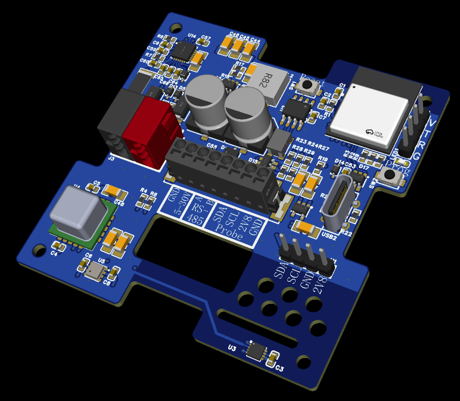

# Habinari

<p align="center">
  <picture>
    <source media="(prefers-color-scheme: dark)" srcset="docs/images/habinari-logo-dark.svg">
    
  </picture>
</p>

**A room climate sensor and HVAC room controller for the ESP32-C6, speaking KNX
TP1, Modbus RTU or MQTT — one device model, three field buses, chosen at build
time.**

*Habinari* — from *habitat* and *naris*: sensing indoor air.

[](LICENSE)

> **Status: work in progress.** The device runs, commissions from ETS and
> answers on Modbus and MQTT, but this is prototype hardware and prototype
> firmware. Interfaces still move between releases. Contributions and feedback
> are welcome — see [CONTRIBUTING.md](CONTRIBUTING.md).

## What it is



A board that measures the air in a room and controls the room's heating and
cooling, rather than only reporting on it. The control loops, the setpoints and
the persisted configuration belong to the device itself; a field bus is one way
to reach it, not the thing that owns it.

### Sensors

- **SCD4x** — CO₂ (photoacoustic NDIR)
- **HDC3020** — temperature, humidity
- **BME688** — barometric pressure, gas / air quality (IAQ, CO₂-equivalent and
  breath-VOC-equivalent via Bosch BSEC — optional, see below)
- **SHT4x** — optional external I²C probe (temperature, humidity), e.g. floor or
  duct

Three sensors measure room temperature and three measure humidity, but they are
not equals: the HDC3020 is fitted for that job and sited away from the board's
heat, while the other two report part of their own self-heating. So the fusion
layer publishes the HDC3020 whenever it is answering, and uses the overlap for
fallback (a dead sensor is replaced silently) and cross-validation (sources that
stop agreeing raise an alarm and name the part that drifted). The
same readings, sampled fast enough to have a slope, drive advisory
rapid-temperature-rise detection, CO₂-derived occupancy and open-window
detection.

### Field-bus personalities

The board carries three interfaces — STKNX (KNX TP1), SP3485EN (RS-485) and the
ESP32-C6's own 2.4 GHz radio and USB. Which of them the firmware speaks is a
**build-time choice**:

| Personality | Transport | Power | Kconfig |
|---|---|---|---|
| KNX TP1 | STKNX, ETS-commissioned | KNX bus, no aux supply | `HABINARI_PROTOCOL_KNX` + `HABINARI_KNX_MEDIUM_TP1` |
| KNX IP | KNXnet/IP routing over Wi-Fi, ETS-commissioned | 5–30 V aux supply | `HABINARI_PROTOCOL_KNX` + `HABINARI_KNX_MEDIUM_IP` |
| Modbus RTU | SP3485EN, RS-485 | either | `HABINARI_PROTOCOL_MODBUS` |
| MQTT | Wi-Fi, Home Assistant discovery | 5–30 V aux supply | `HABINARI_PROTOCOL_MQTT` |

The two KNX rows are one personality on two media, not two personalities. The
device model, the application program, the group objects and every ETS
parameter are identical; what differs is the wire and, because ETS derives a
topology from it, the catalogue entry. See
[docs/knxnet-ip.md](docs/knxnet-ip.md).

Alongside them, and **not** one of them, is an optional out-of-band service
channel over BLE (`HABINARI_OOB_BLE`). It exists for the settings that decide
whether a personality works at all and therefore cannot be written over it — the
Modbus address, the Wi-Fi credentials. It is absent from a KNX **TP1** image,
where ETS already does that job through the programming button and the radio
would cost the bit-banged receiver its timing margin. A KNX **IP** image is the
opposite case and wants it: ETS reaches that device over a Wi-Fi network whose
credentials are exactly what BLE is there to write. See
[docs/ble-commissioning.md](docs/ble-commissioning.md).

### One gate for every protocol

The board has a programming button and an LED, and they mean exactly one thing:
**this device is selected**. Every commissioning path is gated on that one
protocol-neutral state — the KNX individual-address write, BLE advertising, and
the Modbus address commit. A board with its LED lit is the board that can be
commissioned, whatever protocol you reach it with, and it lapses on its own
after 15 minutes so walking away is not the same as leaving the door open.

That is also why a factory-fresh board is **silent on RS-485**: it has no
address, so any number of them can share one pair without colliding, and the
button (or a broadcast write of the serial number on the label) is what gives
one of them a name. Modbus standardises no addressing mechanism, so this is the
board's own convention — [docs/modbus-register-map.md](docs/modbus-register-map.md)
explains it and why the alternatives are worse.

## Getting started

Requires **ESP-IDF v5.3 or later** (developed against v6.1) and an ESP32-C6.

```bash
git clone --recurse-submodules https://github.com/samakinen/habinari-firmware.git
cd habinari-firmware
idf.py set-target esp32c6
idf.py build                       # KNX TP1 + Modbus RTU — the default
idf.py flash monitor
```

If you cloned without `--recurse-submodules`, run
`git submodule update --init --recursive` — the KNX stack
([KNstaX](https://github.com/samakinen/KNstaX)) is a submodule and the default
build needs it.

Building every personality at once:

```bash
tools/build_variants.sh            # all of them, each with its own build dir and sdkconfig
tools/build_variants.sh modbus-ble # just one
tools/build_variants.sh knxip      # KNX over KNXnet/IP, with the BLE channel
```

Use the script rather than `idf.py -B` by hand: `idf.py` defaults to the
project-root `./sdkconfig` regardless of `-B`, so a second variant built without
`-DSDKCONFIG` silently inherits the first one's configuration.

### Host tests

The portable parts of the firmware build and run on the host, no hardware
needed:

```bash
tools/run_main_host_tests.sh
```

That covers the room-control loops and psychrometrics (`test_hvac_control`), the
sensor conditioning, redundancy and event detectors (`test_sensor_fusion`), the
Modbus register map's scaling and addresses (`test_modbus_registers`), the
device-secret KDF and certificate encoding (`test_device_secret`), and the
out-of-band settings registry (`test_device_config`) — including the two
properties every service channel depends on and none can enforce for itself:
that an out-of-range value is refused rather than clamped, and that a secret
never comes back out.

## Documentation

* [docs/hvac-controller-manual.md](docs/hvac-controller-manual.md) — the
  commissioning and integration manual: what the device does, every KNX
  parameter and group object explained for the integrator, worked control
  examples, and troubleshooting.
* [docs/modbus-register-map.md](docs/modbus-register-map.md) — the Modbus RTU
  register map, scaling conventions, worked master transactions, and how a
  board with no address and no DIP switches gets one.
* [docs/knxnet-ip.md](docs/knxnet-ip.md) — the KNXnet/IP medium: what a KNX IP
  device is, commissioning one from ETS6 over the network, the topology rule it
  puts on the installation, KNX/IP Secure Routing, and what is deliberately not
  implemented.
* [docs/protocol-variants.md](docs/protocol-variants.md) — how the field-bus
  personalities are selected and built, why KNX TP1 and the radio cannot share
  an image, and how to add another protocol.
* [docs/mqtt-integration.md](docs/mqtt-integration.md) — the MQTT topic tree,
  the state document, the command topics, and how to provision Wi-Fi and broker
  credentials.
* [docs/ble-commissioning.md](docs/ble-commissioning.md) — the out-of-band
  service channel: the settings registry behind it, the GATT contract, the
  programming-mode gate and the per-device pairing passkey, the `ble_config.py`
  client, and why a KNX image has none of it.

## Architecture

```
sensor_bus / ext_probe   raw I2C acquisition, one cycle every 5 s
        │
sensor_fusion(.hpp)      conditioning, redundancy, cross-validation, trends,
        │                event detection  (platform-free, host-tested)
        ▼
   sensor_data_t          one measurement record; every value carries its validity
        │
        ▼
control_service          OWNS the device: Settings, Inputs, Outputs, NVS and the
        │                1 Hz control tick. control_core.hpp holds the room
        │                controller itself and is platform-free and host-tested.
        │
        │  control_state.h / control_service.hpp
        ▼
  protocol adapters      mappings onto a wire format, and nothing else
        ├── knx_service    KNX TP1 group objects, ETS-commissioned
        ├── mb_rtu_slave   Modbus RTU holding/input/coil/discrete registers
        └── mqtt_service   JSON state + scalar command topics, HA discovery

device_config            the settings a field bus cannot configure — its own
        │                address, its own credentials — contributed by whoever
        │                owns them  (platform-free, host-tested)
        ▼
  oob_service            one channel that renders that registry, and owns none
        └── oob_ble        of it. BLE GATT today; never a personality.
```

The device is `control_service`; the field buses are its clients. Every adapter
is optional and none of them can see another, so a build with no adapter at all
still samples, still runs its control loops and still logs — it simply has
nobody to tell.

That ordering is the point. The control model used to live *inside*
`knx_service.cpp`, which meant KNX was not one way to reach the device, it **was**
the device: turning it off left no control loop, no parameters and no NVS, and
Modbus was a passenger on a KNX stack. `control_state.h` (narrow, C, for any
adapter) and `control_service.hpp` (typed, C++, for in-tree adapters) are the two
views of the one owner. A setpoint written over Modbus or MQTT takes the
identical path a KNX telegram takes, clamping and configured limits included.

### Why KNX TP1 and the radio cannot share an image

`main/src/protocol_registry.c` refuses to compile the Wi-Fi personality or the
Bluetooth controller alongside KNX **on TP1**. The TP1 receiver bit-bangs a
104 µs bit cell and samples at 52 µs, against a measured worst-case ISR jitter
of 51 µs on this board — one microsecond of margin, which a radio stack will
spend. The two are not wanted together anyway: TP1 is the bus-powered
personality and the radio needs the 5–30 V auxiliary supply.

The guard names the medium rather than the protocol, and that distinction is
load-bearing. KNX on the KNXnet/IP medium *is* a radio personality — it reaches
ETS over the same Wi-Fi — so it has no timing conflict with anything, and it
composes with Modbus and the BLE service channel freely.

Adding a protocol is: write the mapping, define one `protocol_adapter_t`, add it
to `protocol_registry.c` behind a Kconfig symbol. Nothing in `main.c`, the
control core or any other adapter changes.

## ETS product export

`main/include/knx_product.hpp` is the single source of truth for both the KNX
runtime and the ETS catalogue entry. Every `idf.py build` of a KNX image
regenerates `ets_export/habinari_<medium>_ets.knxprod.xml` (plus the `.json`
intermediate) from it, so the two can never drift. The directory is gitignored —
the export is a build artefact, not a checked-in file.

The medium follows the image being built, so a TP1 build refreshes
`habinari_tp1_ets` and a KNXnet/IP build refreshes `habinari_ip_ets`. They are
separate catalogue entries because ETS derives what a device may be connected to
from its declared medium; one entry claiming both would let an integrator place
a TP1 board on an IP line and discover it on site.

Skip the regeneration with `idf.py -DHABINARI_ETS_EXPORT=OFF build`, or run it
on its own with
`cmake -S tools/ets_export -B build/ets_export && cmake --build build/ets_export`.

To get an actual `.knxprod` for ETS import, run the XML through OpenKNXproducer
on a host that has it installed: `tools/ets_export/package_with_openknxproducer.ps1`.
The script strips the `MasterData` section first — the exported XML is
self-contained, while a `.knxprod` takes its master data from ETS, and the ETS
signing step aborts with `Naming pair for MasterData cannot be found` if the
section is still there.

ETS keys an application program by manufacturer + number + version and stores a
hash of its content, so it refuses to import a changed program that still claims
an existing key ("the product has a different hash than the existing product").
Bump `kApplicationVersion` in `knx_product.hpp` after any change to the
ETS-visible content, or delete the old product from the ETS catalogue first.
See [docs/knxnet-ip.md](docs/knxnet-ip.md#4-two-catalogue-entries-one-device)
for the full set of identities that distinguish the two catalogue entries.

The KNX manufacturer ID in the product definition is a **development
placeholder** — see [THIRD-PARTY-NOTICES.md](THIRD-PARTY-NOTICES.md) before
distributing anything as a KNX product.

## Air quality (Bosch BSEC)

IAQ, CO₂-equivalent and breath-VOC-equivalent come from Bosch's BSEC library,
which is proprietary, redistribution-forbidden and therefore **not in this
repository**. `CONFIG_BME688_USE_BSEC` is off by default and the component
compiles as inert stubs, so the firmware builds with no external dependency and
no air-quality output. To enable it, download BSEC from Bosch Sensortec under
their license agreement and follow
[components/bsec2/README.md](components/bsec2/README.md).

## Device root secret, the KNX FDSK and the BLE passkey

The device's per-device credentials are not stored anywhere. They are derived on
every boot from a 256-bit root secret in a read-protected eFuse key block:

```
FDSK    = HMAC-SHA256(root, "KNstaX/KNX-FDSK/v1"      || serial[6])[0..15]
passkey = HMAC-SHA256(root, "habinari/BLE-passkey/v1" || serial[6])[0..3] mod 10^6
```

The root secret is used through the HMAC peripheral, so software can never read
it back. That makes both survive `knx_service_reset_nvm()`, a full `erase-flash`
and OTA, while the same firmware image still gives every board different keys —
see `main/include/device_secret.hpp` for the reasoning.

Two labels, one root. Domain separation is what lets a second printable
credential be added without either revealing the other, and it is why the BLE
commissioning passkey did not need any new key infrastructure: it is the same
problem the FDSK already solved.

### Provisioning is a dry run by default

`CONFIG_HABINARI_ROOT_SECRET_BURN` is **off**, so an unprovisioned device runs
the whole path on each boot and burns nothing:

```
idf.py flash monitor
```

Look for `device_secret` lines reporting the RNG sample statistics, the
candidate root secret, and the FDSK and ETS certificate it would derive. The
candidate is discarded and regenerated every boot until burning is enabled.
While unprovisioned the device falls back to the legacy NVS-stored random tool
key, which a factory reset still replaces.

### Burning for real

Set `CONFIG_HABINARI_ROOT_SECRET_BURN=y` and reflash. The next boot writes the
secret into `BLOCK_KEY5` (configurable) permanently, then cross-checks the
peripheral's derivation against the software one and logs the final
certificate. Print that certificate on the device label — it stays valid for the
life of the chip.

The production alternative is to burn the block from the host during flashing,
which uses the host CSPRNG rather than the chip's ADC noise:

```
espefuse.py burn_key BLOCK_KEY5 root_secret.bin HMAC_UP
```

Either way the firmware detects the provisioned block and derives from it.

## Repository layout

```
main/            the application: acquisition, fusion, control core, adapters
main/test/       host tests for every platform-free part
components/      KNstaX (KNX stack, submodule) and the I2C sensor drivers
docs/            integration manuals, one per interface
tools/           build scripts, the ETS exporter, the BLE commissioning client
cmake/           build glue that keeps the ETS export in step with the firmware
```

## Contributing and security

* [CONTRIBUTING.md](CONTRIBUTING.md) — how to build, test and submit changes,
  and the licensing terms contributions are accepted under.
* [SECURITY.md](SECURITY.md) — how to report a vulnerability, and what the
  device's security model does and does not promise.

## License

Copyright © 2025–2026 Sami Mäkinen.

Habinari is free software: you may redistribute it and/or modify it under the
terms of the **GNU General Public License, version 3 or (at your option) any
later version**. It is distributed in the hope that it will be useful, but
**without any warranty** — without even the implied warranty of merchantability
or fitness for a particular purpose. See [LICENSE](LICENSE) for the full text.

Third-party code, the proprietary Bosch BSEC library and the KNX trademark
notice are covered in [THIRD-PARTY-NOTICES.md](THIRD-PARTY-NOTICES.md).
